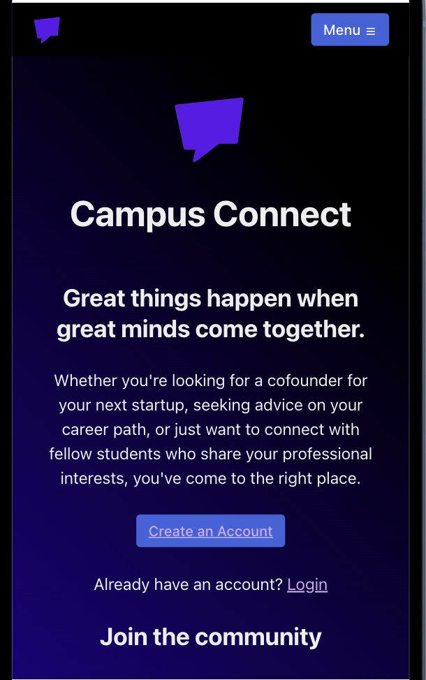

# Cofounder-Matcher

## Description

This is an application to enable students to find and connect with other people on their campuses that are also interested in founding or working on a new business. Users are able to create a profile containing information about their interests, ideas and skills. Users can view other profiles and initiate conversations with others to propose working together and becoming cofounders.

## Getting Started 

#### Application Link

[Launch the app](https://cofounder-matcher.vercel.app/)

#### Backend Github Repo

[View Codebase](https://github.com/joshlogan103/cofounder-matcher-backend)

## Contributors

Alexa Clark -
[Github](https://github.com/lexgwc)

Addy Jaime -
[Github](https://github.com/AddyJaime)

Erika Pinzon -
[Github](https://github.com/Erika90P)

Josh Logan -
[Github](https://github.com/joshlogan103)

## Attributions

* Radix-ui
* Firebase
* Vite

## Techonologies Used

* React
* Javascript
* HTML/CSS
* Node
* Express
* Axios
* Mondodb
* Mongoose
* Socket.io
* JWT
* Bcyrpt

## Next Steps

* Cache logged in state client side with a cache control directive to avoid loading times for components and protected routes that require checking that the user is logged in
* Revisit Socket.io and implement chat via the websocket
* Make small design updates to make the app feel as modern and clean as possible
* Make the edit profile page auto-fill with existing values to ease profile updates for the user
* Create an admin portal for management of schools and users
* Convert all styling to exactly match the Radix components

